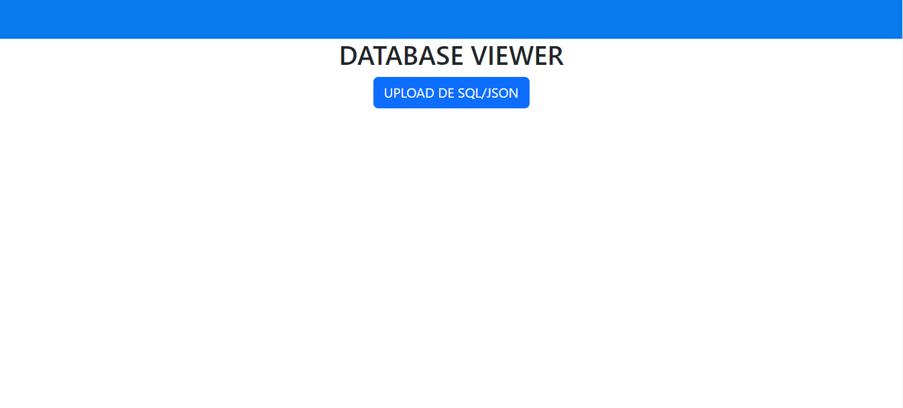
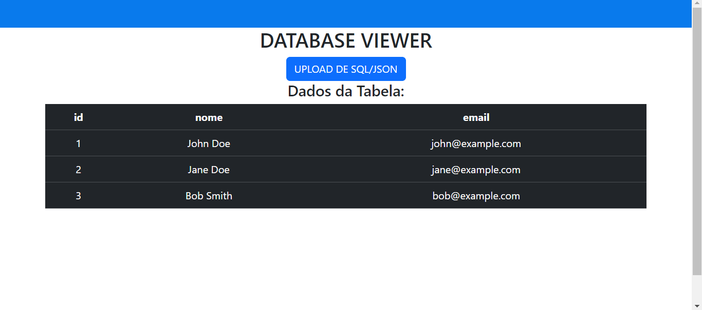

# DATABASE VIEWER
👨‍🏫VISUALIZE OS DADOS SQL E JSON EM FORMATO DE TABELA.

 <br> 
 <br> 

## DESCRIÇÃO:
Este aplicativo é um visualizador de dados que permite ao usuário fazer o upload de arquivos SQL ou JSON e exibir os dados contidos nesses arquivos em uma tabela. Aqui está um resumo das funcionalidades:

1. **Upload de Arquivos**:
   - O usuário pode fazer o upload de arquivos SQL ou JSON clicando em um botão de upload.
   - O app processa o arquivo enviado para extrair e exibir os dados.

2. **Processamento de Arquivos**:
   - **SQL**: O app lê e processa arquivos SQL que contêm instruções `INSERT INTO`. Ele extrai os dados da instrução e os converte para um formato tabular.
   - **JSON**: O app lê arquivos JSON e exibe os dados em formato de tabela. Ele suporta tanto arrays de objetos quanto objetos únicos.

3. **Exibição de Dados**:
   - Os dados extraídos são exibidos em uma tabela com uma aparência escura.
   - A tabela exibe colunas e linhas de acordo com os dados extraídos do arquivo.

4. **Tratamento de Erros**:
   - Se ocorrer um erro durante o processamento do arquivo (por exemplo, formato inválido ou erro de leitura), uma mensagem de erro é exibida para o usuário.

## EXECUTANDO O PROJETO:
1. **Instalar as dependências do projeto**:
   - Execute o comando no diretório `CODIGO/`:
     ```cmd
     npm install
     ```

   - Este comando instala todas as dependências listadas no arquivo `package.json` do seu projeto.

2. **Executando o Aplicativo:**
   - Ainda no diretório `CODIGO/`, abra o terminal ou prompt de comando e digite o seguinte comando:
   ```bash
   npm run serve
   ```

   - Acesse o aplicativo no navegador visitando: [http://localhost:8080/](http://localhost:8080/).
   
3. **Fazer o Upload de um Arquivo**:
   - Clique no botão "UPLOAD DE SQL/JSON" para abrir o seletor de arquivos.
   - Selecione um arquivo SQL ou JSON do diretório `./DATABASES`.

4. **Visualizar os Dados**:
   - Após o upload, o app processará o arquivo e exibirá os dados em uma tabela na página.
   - Se o arquivo for SQL, ele deve conter instruções `INSERT INTO` com dados a serem exibidos.
   - Se o arquivo for JSON, ele deve conter dados no formato JSON que serão exibidos na tabela.

5. **Tratar Erros**:
   - Se o arquivo não for no formato correto ou se ocorrer um problema durante o processamento, uma mensagem de erro será exibida. Certifique-se de que o arquivo está no formato correto para evitar erros.

## NÃO SABE?
- Entendemos que para manipular arquivos em `HTML`, `CSS` e outras linguagens relacionadas, é necessário possuir conhecimento nessas áreas. Para auxiliar nesse aprendizado, oferecemos cursos gratuitos disponíveis:
* [CURSO DE HTML E CSS](https://github.com/VILHALVA/CURSO-DE-HTML-E-CSS)
* [CURSO DE BOOTSTRAP](https://github.com/VILHALVA/CURSO-DE-BOOTSTRAP)
* [CURSO DE NODEJS](https://github.com/VILHALVA/CURSO-DE-NODEJS)
* [CURSO DE JAVASCRIPT](https://github.com/VILHALVA/CURSO-DE-JAVASCRIPT)
* [CURSO DE VUEJS](https://github.com/VILHALVA/CURSO-DE-VUEJS)
* [CURSO DE MYSQL](https://github.com/VILHALVA/CURSO-DE-MYSQL)
* [CURSO DE NODEJS COM MYSQL](https://github.com/VILHALVA/CURSO-DE-NODEJS-COM-MYSQL)
* [CURSO DE JSON](https://github.com/VILHALVA/CURSO-DE-JSON)
* [CONFIRA MAIS CURSOS](https://github.com/VILHALVA?tab=repositories&q=+topic:CURSO)

## CREDITOS:
- [PROJETO CRIADO PELO VILHALVA](https://github.com/VILHALVA)


